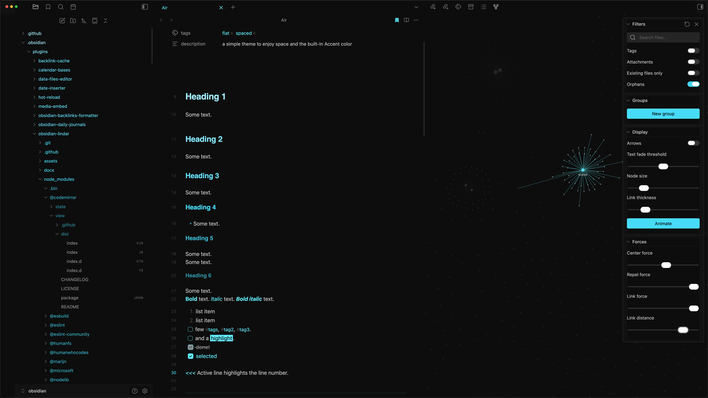
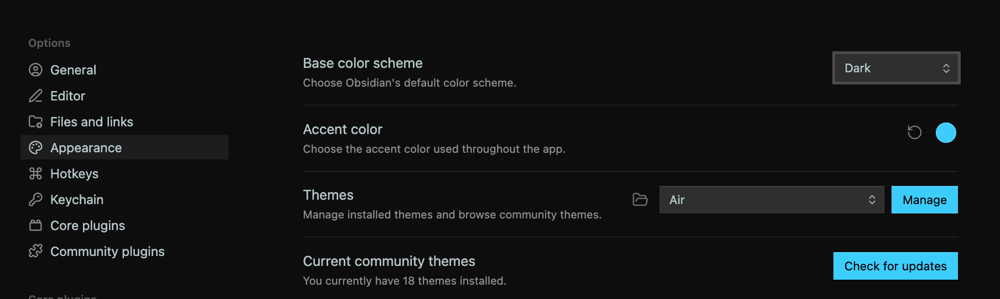
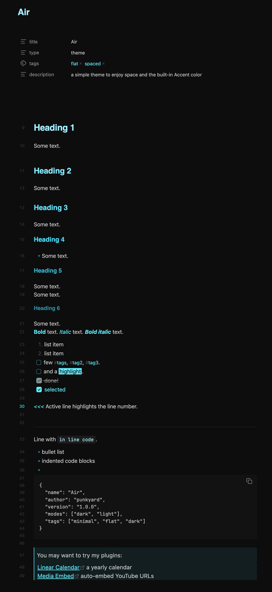
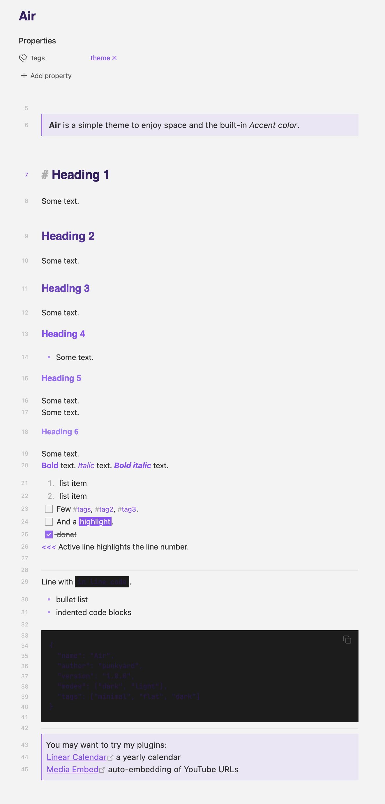
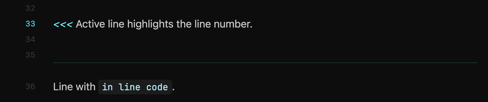

# Air
>A flat, ultra-dark Obsidian theme. Minimal chrome, padded headings, accent color drives everything.

## Installation

Search **Air** in *Settings > Appearance > Themes*
Choose your favorite **accent color** from *Settings > Options > Appearance > Accent color*

---

## Design

- One uniform surface, no pane borders
- Your chosen **accent color** propagates to headings (H1–H6), bold, italic, highlights, tags, active states, checkboxes, and list bullets
- `headings-font.woff2` is the font file used for all headings and can be replaced
- Text: near-white normal, stepped grays for muted/faint
- Zero border-radius throughout
- **Ribbon** hides until hover
- **Properties** and Add property hide until hover
- Active line highlights the line number
- **Tags**: accent text, no background or border
- Supports **dark** and **light** mode

| dark                         | light                           |
| ---------------------------- | ------------------------------- |
|  |  |

---

### License

This project is under the **[MIT License](LICENSE)**.

---
  

made with ⏳ by <a href="https://github.com/punkyard">punkyard</a>
